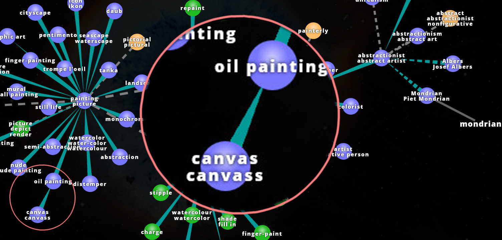
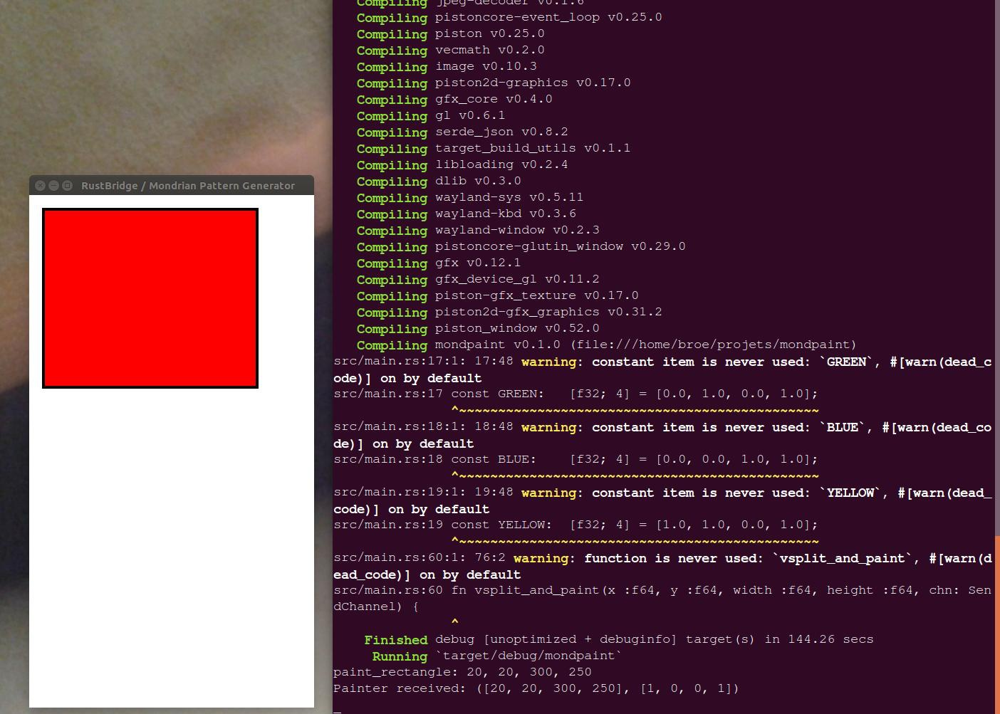
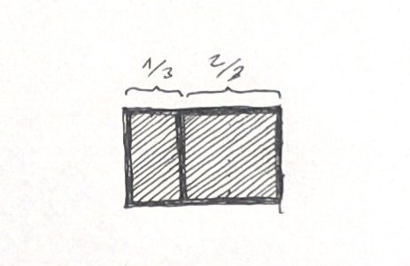
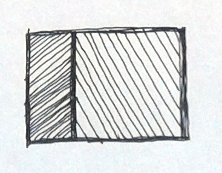
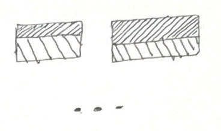
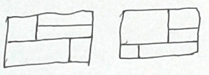

Mondrian Pattern Generator
==========================

<a title="Piet Mondrian [Public domain], via Wikimedia Commons" href="https://commons.wikimedia.org/wiki/File%3ATableau_I%2C_by_Piet_Mondriaan.jpg">
</a>


Piet Mondrian (7 March 1872 - 1 February 1944) is propably best known for establishing a distinctive visual pattern in our cultural heritage. Its characteristic way of creating images by making subsequent, orthogonal subdivisions has inspired not only fasion designers and confectioners but also [computer scientists](https://github.com/qiyuangong/Mondrian).

<a title="By Eric Koch / Anefo (Nationaal Archief) [CC BY-SA 3.0 (http://creativecommons.org/licenses/by-sa/3.0)], via Wikimedia Commons" href="https://commons.wikimedia.org/wiki/File%3AMondriaanmode_door_Yves_St_Laurent_(1966).jpg"></a>
<a title="By Heidi De Vries [CC BY 2.0 (http://creativecommons.org/licenses/by/2.0)], via Wikimedia Commons" href="https://commons.wikimedia.org/wiki/File%3AMondrian_Cake.jpg"></a>

**All Images from:** [Wikimedia Commons](https://commons.wikimedia.org/)


Information Processing
----------------------

The universe is incredibly complex. When it comes to information processing technology, the first step to solving a problem is to understand the problem in a precise way.

What am I interested in?
What am I _not_ interested in?
Which information do I have?
Which information do I need?
How can I derive or _create_ the information I need based on the information I have.

The mondrian universe
---------------------


**Image from:** [Visuwords (TM)](http://visuwords.com)

Not incredibly complex, yet, too complex and vague for a straight-forward information processing problem.


### What to focus on?


**What are we not interested in?** (At least not for our little project here.) His biography. The techniques of painting. And so on.

**What are we interested in?** The paintings of Piet Mondrian. They are oil paintings on canvas. The canvas is made of some fabric (linen) which is a plant... The paint is some colourful substances mixed with oil as a suspension -- **STOP!** We could continue like this for ever.

**What aspect(s) of his paintings are we interested in?** The distinctive visual patterns. For us as humans all these things are often immediately clear but for the machines we want to program it is not.


### Mondrian Patterns

What makes this type of pattern _this_ type of pattern?

With this description we will certainly make an over-simplification, omitting many aspects of the choices he made regarding composition, geometry, colour... We will see more of the complexity the further we proceed.

* We see the _canvas_ as a rectangular surface that has a colour at each location. Initially it is white or some other more or less uniform colour.

* The Mondrian Painting is a canvas filled with coloured rectangular areas bounded by black borders.

This is (still) not precise enough to define the distinctive pattern we are interested in. It could also mean something like [random rectangles](https://williamaadams.wordpress.com/2013/12/12/multitask-ui-like-its-1995/).

Up to now, nothing in our _definition_ makes sure the rectangles

* are aligned with the edge of the canvas,
* cover the whole canvas,
* do not overlap, producing non-rectangular remainders.

TODO: Add more odd examples

**Definition:** With _Mondrian Pattern_ we will refer to a rectangular area, the _canvas_, that is filled _completely_ with differently _coloured rectangles_. The rectangles are oriented 'upright' so that their edges are aligned with the borders of the canvas.


Processing Mondrian Patterns
----------------------------

We know _what_ we want to achieve but we do not now _how_ we can achieve it.

TODO: Most simple example: One filled Rectangle

TODO: Second most simple example: One Subdivision

TODO: Complex example: More subdivisions


To fill a given rectangular _canvas_ with a pattern that satisfies the criteria of the definition we can use these steps:

1. Make vertical/horizontal subdivisions so that rectangular sub-regions emerge.
2. Paint each sub-region with a coloured rectangle and paint a black border around it.

There are other ways of achieving similar or the same type of pattern. Also, we are far from a level of precision that would suit programming a machine to do it. But for us, we have gained a lot of precision already.


Practice
---------

### Getting started with coding

Make a new project named `mondpaint`:

* type `cargo new --bin mondpaint` into the console and hit the `Enter` key.

* type `cd mondpaint` into the console, and hit the `Enter` key.

* For the time being you can find more detailed instructions at [Step 1 of these instructions](https://github.com/broesamle/RustWorkshop/blob/master/minimals/countinghands.md#step1-your-first-project)

* TODO: link to installfest instructuins as soon as they are ready

#### [Testing]

Create an executable program and execute it:

* type `cargo run` into the console and hit the `Enter` key.

Your console should now look like this:


### Exercise 0: Start with a prepared minimal mondrian pattern


At this point, you have executed a minimal `Hello World` rust project already!
Now, replace that first project with the minimal mondrian pattern generator:

* Open the files `main.rs` (in the subfoler `src`) and `Cargo.toml` in your text editor.
    * Again, if you are unsure where to find the files and/or how to open them in a text editor there are [very detailed instructions in Step 2 and 3 here](https://github.com/broesamle/RustWorkshop/blob/master/minimals/countinghands.md#step-2-where-is-the-program).
    * TODO: link to installfest instructuins as soon as they are ready

* Clicking the links will show the file content in the browser window.
    + [new main.rs](https://raw.githubusercontent.com/rust-community/rustbridge/389c0502113503eccae6626561920083959cbe07/workshops/mondrian-pattern/codebase/mondpaint/src/main.rs)
    + [new Cargo.toml](https://raw.githubusercontent.com/rust-community/rustbridge/389c0502113503eccae6626561920083959cbe07/workshops/mondrian-pattern/codebase/mondpaint/Cargo.toml)

What you see looks quite complex and like a foreign language. True, it is rust, the language you will learn now! At this point, you don't need to understand it. You just have to copy and paste it :-)


* Copy and paste it from there into the file in the text editor. (Do it for both files in the same way.)

* Save the files in your editor.

#### [Testing]

* Make sure your machine has an internet connection working.

* To execute the program do again `cargo run`.

Your rust compiler will work for some time now

* Then, see what happens: can you see a very minimal mondrian pattern (a red rectangle with a black frame) in a window?
    + In windows, it happens that the window is hidden behind other open windows.
    + TODO: Fix that!

You should see something similar to this:


Congratulations, you have made a project, adapted it so that it matches an example, and executed it successfully!

#### [Explanation]

Although the mondrian pattern in the window is what we're here for, it is worth looking at the console window as well. Don't worry about the warnings for now. Rust tells us that there are things in the program that are never used. We will use them soon!


### Exercise 1: Make one vertical split
It is now time to have a closer look at the example


#### [Instruction] 1


#### [Snapshot] 1
[view changes](https://github.com/rust-community/rustbridge/commit/754dc60730f0fd16f6001785aee533128326d6b5)
|
[download main.rs](https://raw.githubusercontent.com/rust-community/rustbridge/754dc60730f0fd16f6001785aee533128326d6b5/workshops/mondrian-pattern/codebase/mondpaint/src/main.rs)


### Exercise 2:


#### [Snapshot] 2
[view changes](https://github.com/rust-community/rustbridge/commit/1dcdf3125943137fb231e9514c73b5136e1206cb)
|
[download main.rs](https://github.com/rust-community/rustbridge/commit/1dcdf3125943137fb231e9514c73b5136e1206cb/workshops/mondrian-pattern/codebase/mondpaint/src/main.rs)


### Exercise 3:

TODO: Check example for exercise 3/4 -- there is one snapshot for two exercises, currently.


#### [Snapshot] 3
[view changes](https://github.com/rust-community/rustbridge/commit/c24797b80d1f0c9039c722159e137dc531f140fb)
|
[download main.rs](https://github.com/rust-community/rustbridge/commit/c24797b80d1f0c9039c722159e137dc531f140fb/workshops/mondrian-pattern/codebase/mondpaint/src/main.rs)


### Exercise 4:


#### [Snapshot] 4
[view changes](https://github.com/rust-community/rustbridge/commit/c24797b80d1f0c9039c722159e137dc531f140fb)
|
[download main.rs](https://github.com/rust-community/rustbridge/commit/c24797b80d1f0c9039c722159e137dc531f140fb/workshops/mondrian-pattern/codebase/mondpaint/src/main.rs)


#### [Testing] Exercise 4:  
Error message after adding an extra parameter to `paint_rectangle`:
```
Compiling mondpaint v0.1.0 (file:///home/broe/projets/rustbridge/workshops/mondrian-pattern/codebase/mondpaint)
src/main.rs:80:9: 80:57 error: this function takes 6 parameters but 5 parameters were supplied [E0061]
src/main.rs:80         paint_rectangle(x, y, splitpos, height, chnleft)
                    ^~~~~~~~~~~~~~~~~~~~~~~~~~~~~~~~~~~~~~~~~~~~~~~~
src/main.rs:80:9: 80:57 help: run `rustc --explain E0061` to see a detailed explanation
src/main.rs:80:9: 80:57 note: the following parameter types were expected: f64, f64, f64, f64, [f32; 4], std::sync::mpsc::Sender<([f64; 4], [f32; 4])>
src/main.rs:85:9: 85:73 error: this function takes 6 parameters but 5 parameters were supplied [E0061]
src/main.rs:85         paint_rectangle(x+splitpos, y, width-splitpos, height, chnright)
                    ^~~~~~~~~~~~~~~~~~~~~~~~~~~~~~~~~~~~~~~~~~~~~~~~~~~~~~~~~~~~~~~~
src/main.rs:85:9: 85:73 help: run `rustc --explain E0061` to see a detailed explanation
src/main.rs:85:9: 85:73 note: the following parameter types were expected: f64, f64, f64, f64, [f32; 4], std::sync::mpsc::Sender<([f64; 4], [f32; 4])>
error: aborting due to 2 previous errors
error: Could not compile `mondpaint`.
```


### Exercise 5:


For Exercice 5 we will use random numbers to make things more interesting.

A coupple of things are already prepared in the example.
There is a new operation for generating random numbers available: `rng.gen_range(0.0, 20.0)` will produce a random number between `0.0` and `20.0`.


Currently this is deactivated by placing them in a _comment_:
```
// the remainder of a line after a double forward slash will be ignored

/*
Furthermore, everything between slash star and
star slash is also ignored, even over multiple lines
*/
```

#### [Instruction] 5
1. Uncomment lines ____: `use rand::Rng;` and ____ `let mut rng = rand::thread_rng();   //init a random number generator`.

2. Modify the operation `vsplit_and_paint` to generate a random split position. The value to be used as split position is calculated in line 76 `let splitpos = rng.gen_range(0.0, width);` Use the operation we just activated `rng.gen_range(...)`.

#### [Snapshot] 5
[view changes](https://github.com/rust-community/rustbridge/commit/30c7b9c62453ab456029ca480e07d7e33b5c0f93)
|
[download main.rs](https://github.com/rust-community/rustbridge/commit/30c7b9c62453ab456029ca480e07d7e33b5c0f93/workshops/mondrian-pattern/codebase/mondpaint/src/main.rs)


### Exercise 6:


#### [Snapshot] 6
[view changes](https://github.com/rust-community/rustbridge/commit/aae0b114be1d8996f18db88998d4fe0b3c047201)
|
[download main.rs](https://github.com/rust-community/rustbridge/commit/aae0b114be1d8996f18db88998d4fe0b3c047201/workshops/mondrian-pattern/codebase/mondpaint/src/main.rs)


#### [Testing]
After defininf the new operation `vsplit_and_paint`, build output should look like this:
```
Compiling mondpaint v0.1.0 (file:///home/broe/projets/rustbridge/workshops/mondrian-pattern/codebase/mondpaint)
src/main.rs:23:1: 23:48 warning: constant item is never used: `GREEN`, #[warn(dead_code)] on by default
src/main.rs:23 const GREEN:   [f32; 4] = [0.0, 1.0, 0.0, 1.0];
            ^~~~~~~~~~~~~~~~~~~~~~~~~~~~~~~~~~~~~~~~~~~~~~~
src/main.rs:25:1: 25:48 warning: constant item is never used: `YELLOW`, #[warn(dead_code)] on by default
src/main.rs:25 const YELLOW:  [f32; 4] = [1.0, 1.0, 0.0, 1.0];
            ^~~~~~~~~~~~~~~~~~~~~~~~~~~~~~~~~~~~~~~~~~~~~~~
src/main.rs:91:1: 107:2 warning: function is never used: `hsplit_and_paint`, #[warn(dead_code)] on by default
src/main.rs:91 fn hsplit_and_paint(x :f64, y :f64, width :f64, height :f64, chn: mpsc::Sender<(Rectangle, Color)>) {
            ^
 Finished debug [unoptimized + debuginfo] target(s) in 2.88 secs
```


### Exercise 7a:

It is now time to test the new operation! Currently, `hsplit_and_paint` triggers `paint_rectangle` for both sides of the split: lines 79 (?) and 85 (?): `paint_rectangle(x, y, splitpos . . .` and `paint_rectangle(x+splitpo, y, . . .`. Modify `hsplit_and_paint` so that it triggers `paint_rectangle` on the left side of the split and `hsplit_and_paint` on the right side.


#### [Snapshot] 7a
[view changes](https://github.com/rust-community/rustbridge/commit/3249caaa11f91b34344999809294c1d05493b597)
|
[download main.rs](https://github.com/rust-community/rustbridge/commit/3249caaa11f91b34344999809294c1d05493b597/workshops/mondrian-pattern/codebase/mondpaint/src/main.rs)


### Exercise 7b:


#### [Snapshot] 7b
[view changes](https://github.com/rust-community/rustbridge/commit/e84d28afedec182ac5d1a148f7602ce756c246bd)
|
[download main.rs](https://github.com/rust-community/rustbridge/commit/e84d28afedec182ac5d1a148f7602ce756c246bd/workshops/mondrian-pattern/codebase/mondpaint/src/main.rs)


### Exercise 8:

Option 1: Introduce more special operations
Option 2:
Try to use only the operations we have defined so far -- you will fail in a funny way!
;-)

#### [Snapshot] 8
[view changes](https://github.com/rust-community/rustbridge/commit/560ef8cf6a9df67151bfa65bdab7a07655fcd77d)
|
[download main.rs](https://github.com/rust-community/rustbridge/commit/560ef8cf6a9df67151bfa65bdab7a07655fcd77d/workshops/mondrian-pattern/codebase/mondpaint/src/main.rs)


### Exercise 9: Avoiding the infinite pattern generation process.

#### [Snapshot] 9
[view changes](https://github.com/rust-community/rustbridge/commit/6a51b31a396e7a9200ac21a0cc5ab574915a3b2f)
|
[download main.rs](https://github.com/rust-community/rustbridge/commit/6a51b31a396e7a9200ac21a0cc5ab574915a3b2f/workshops/mondrian-pattern/codebase/mondpaint/src/main.rs)


### TODO: Integrate text instructions above.


### TODO: Add instructions to keep track of operations executed. -- This may be better placed in the beginning, before coding.


Beyond this Workshop
--------------------

### Why neighbours should be aware of each other

Avoid unlucky encounters of frames and colours.


TODO: Links to more detailed instructive minimals.
