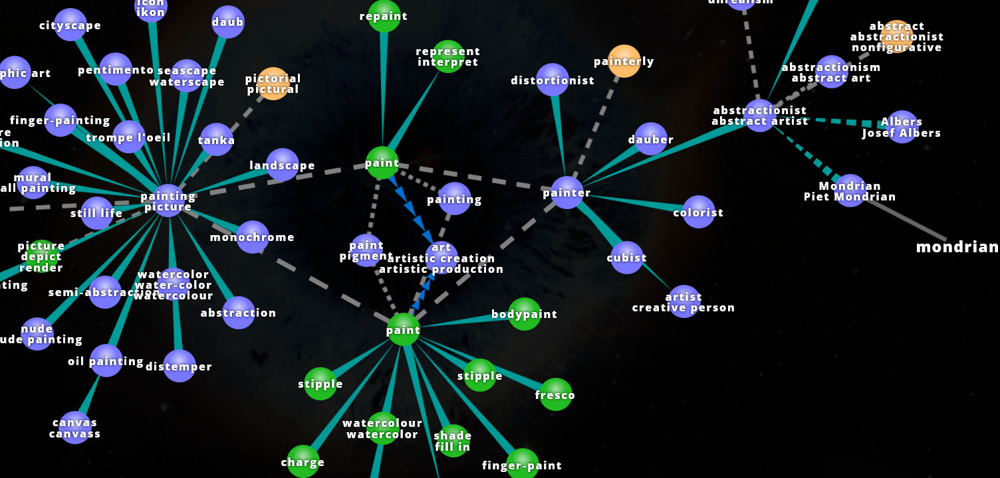

Mondrian Pattern Generator
==========================

Piet Mondrian (7 March 1872 - 1 February 1944) is propably best known for establishing a distinctive visual pattern in our cultural heritage. Its characteristic way of creating images by making subsequent, orthogonal subdivisions has inspired not only fasion designers and confectioners but also [computer scientists](https://github.com/qiyuangong/Mondrian).

**All Images from:** [Wikimedia Commons](https://commons.wikimedia.org/)

Information Processing
----------------------

The universe is incredibly complex. When it comes to information processing technology, the first step to solving a problem is to understand the problem in a precise way.

What am I interested in?
What am I _not_ interested in?
Which information do I have?
Which information do I need?
How can I derive or _create_ the information I need based on the information I have.

The mondrian universe
---------------------

**Image from:** [Visuwords (TM)](http://visuwords.com)

Not incredibly complex, yet, too complex and vague for a straight-forward information processing problem.

### What to focus on?

* What are we not interested in? His bio. The chemistry of the paint. The physical making of the canvas.

* What are we interested in? The paintings of Piet Mondrian. All of it? No, only the distinctive visual pattern.

Let us describe what makes this pattern _this_ pattern.

### Mondrian Patterns

With this description we will certainly make an over-simplification even when considering the composition of geometry and colour of Piet Mondrian. We will see more complexity the further we proceed.

For the moment, lets think of it as three steps:

1. Start with an empty, rectangular _canvas_.
2. Make vertical/horizontal subdivisions so that rectangular sub-regions emerge.
3. Paint each sub-region with a coloured rectangle and paint a black border around it.

There are other ways of achieving similar or the same type of pattern. Also, we are far from a level of precision that would suit programming a machine to do it. But for us, we have gained a lot of precision already.

TODO: Quick overview for for absolute beginners
-----------------------------------------------

* Image generation as information processing
* Operations and data structures
* Sngle/Multi threadded computing
    * Processor
    * Shared ressources (The canvas)

TODO: Links to more detailed instructive minimals.

Processing Mondrian Patterns
----------------------------

### Devide and delegate

### Why neighbours should be aware of each other

Avoid unlucky encounters of frames and colours.

