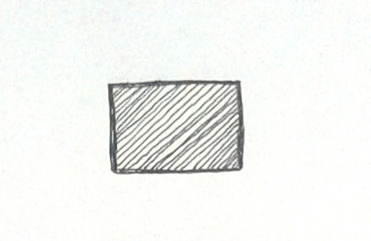
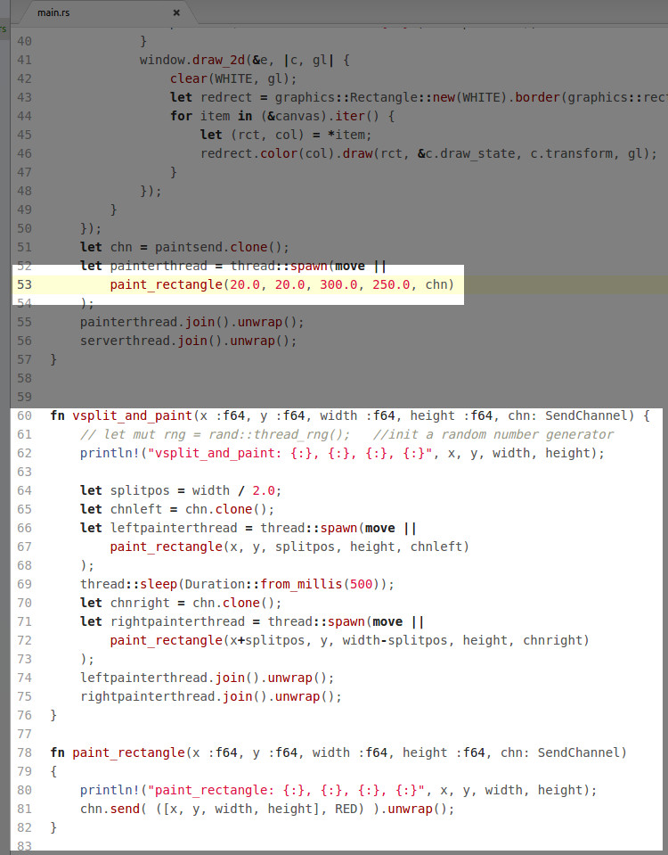
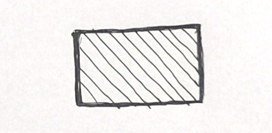
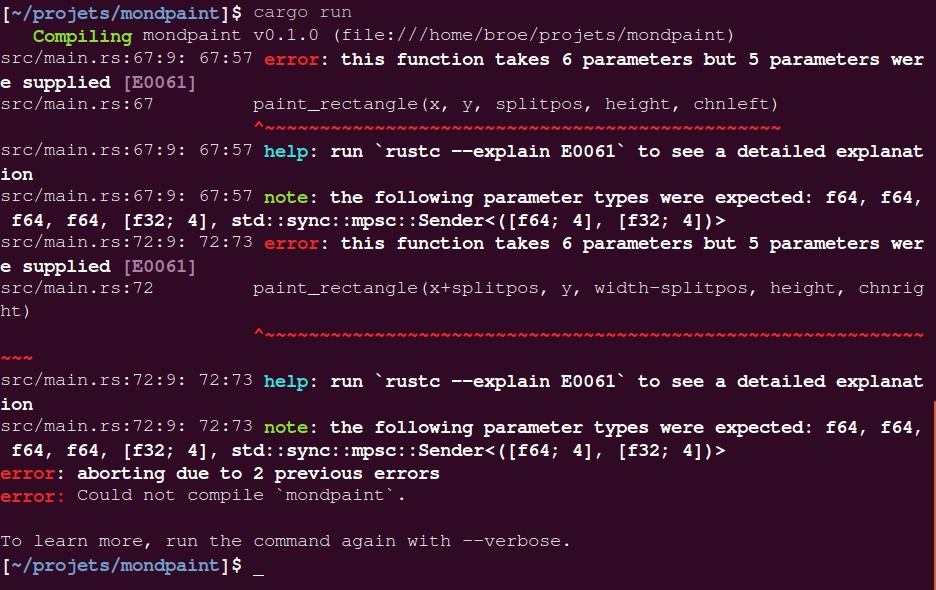
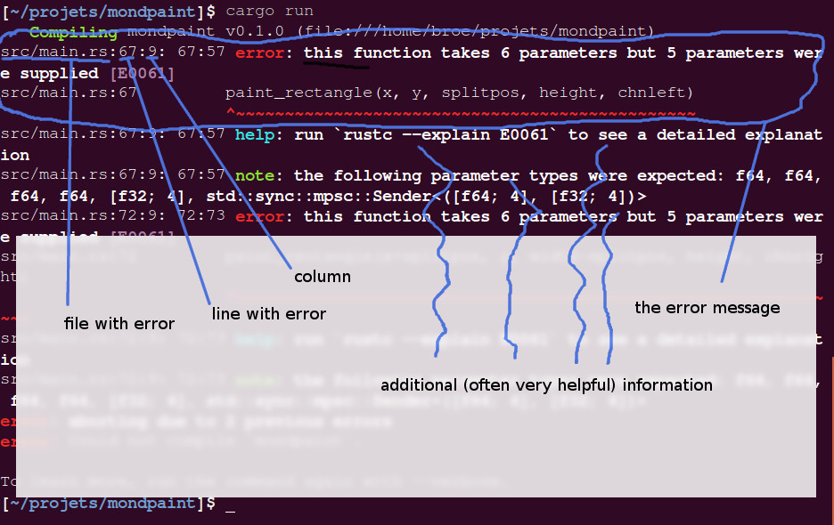
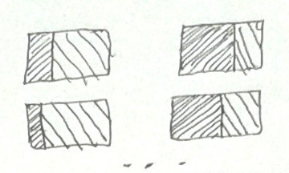
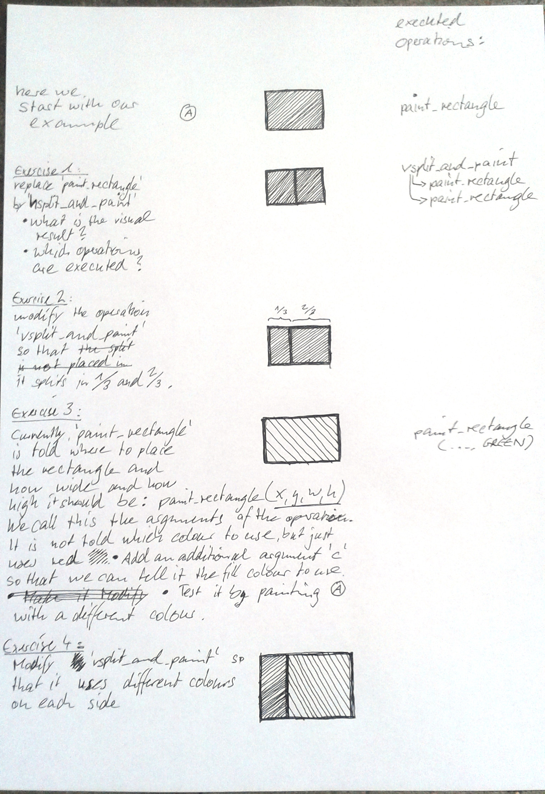
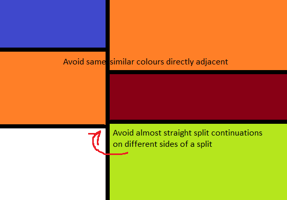

Mondrian Pattern Generator
==========================

<a title="Piet Mondrian [Public domain], via Wikimedia Commons" href="https://commons.wikimedia.org/wiki/File%3ATableau_I%2C_by_Piet_Mondriaan.jpg">
</a>


Piet Mondrian (7 March 1872 - 1 February 1944) is propably best known for establishing a distinctive visual pattern in our cultural heritage. Its characteristic way of creating images by making subsequent, orthogonal subdivisions has inspired not only fasion designers and confectioners but also [computer scientists](https://github.com/qiyuangong/Mondrian).

<a title="By Eric Koch / Anefo (Nationaal Archief) [CC BY-SA 3.0 (http://creativecommons.org/licenses/by-sa/3.0)], via Wikimedia Commons" href="https://commons.wikimedia.org/wiki/File%3AMondriaanmode_door_Yves_St_Laurent_(1966).jpg"></a>
<a title="By Heidi De Vries [CC BY 2.0 (http://creativecommons.org/licenses/by/2.0)], via Wikimedia Commons" href="https://commons.wikimedia.org/wiki/File%3AMondrian_Cake.jpg"></a>

**All Images from:** [Wikimedia Commons](https://commons.wikimedia.org/)


Information Processing
----------------------

The universe is incredibly complex. When it comes to information processing technology, the first step to solving a problem is to understand the problem in a precise way.

What am I interested in?
What am I _not_ interested in?
Which information do I have?
Which information do I need?
How can I derive or _create_ the information I need based on the information I have.

The mondrian universe
---------------------


**Image from:** [Visuwords (TM)](http://visuwords.com)

Not incredibly complex, yet, too complex and vague for a straight-forward information processing problem.


### What to focus on?


**What are we not interested in?** (At least not for our little project here.) His biography. The techniques of painting. And so on.

**What are we interested in?** The paintings of Piet Mondrian. They are oil paintings on canvas. The canvas is made of some fabric (linen) which is a plant... The paint is some colourful substances mixed with oil as a suspension -- **STOP!** We could continue like this for ever.

**What aspect(s) of his paintings are we interested in?** The distinctive visual patterns. For us as humans all these things are often immediately clear but for the machines we want to program it is not.


### Mondrian Patterns

What makes this type of pattern _this_ type of pattern?

With this description we will certainly make an over-simplification, omitting many aspects of the choices he made regarding composition, geometry, colour... We will see more of the complexity the further we proceed.

* We see the _canvas_ as a rectangular surface that has a colour at each location. Initially it is white or some other more or less uniform colour.

* The Mondrian Painting is a canvas filled with coloured rectangular areas bounded by black borders.

This is (still) not precise enough to define the distinctive pattern we are interested in. It could also mean something like [random rectangles](https://williamaadams.wordpress.com/2013/12/12/multitask-ui-like-its-1995/).

Up to now, nothing in our _definition_ makes sure the rectangles

* are aligned with the edge of the canvas,
* cover the whole canvas,
* do not overlap, producing non-rectangular remainders.

TODO: Add more odd examples

**Definition:** With _Mondrian Pattern_ we will refer to a rectangular area, the _canvas_, that is filled _completely_ with differently _coloured rectangles_. The rectangles are oriented 'upright' so that their edges are aligned with the borders of the canvas.


Processing Mondrian Patterns
----------------------------

We know _what_ we want to achieve but we do not now _how_ we can achieve it.

TODO: Most simple example: One filled Rectangle

TODO: Second most simple example: One Subdivision

TODO: Complex example: More subdivisions


To fill a given rectangular _canvas_ with a pattern that satisfies the criteria of the definition we can use these steps:

1. Make vertical/horizontal subdivisions so that rectangular sub-regions emerge.
2. Paint each sub-region with a coloured rectangle and paint a black border around it.

There are other ways of achieving similar or the same type of pattern. Also, we are far from a level of precision that would suit programming a machine to do it. But for us, we have gained a lot of precision already.


Practice
---------

### Getting started with coding

Make a new project named `mondpaint`:

* type `cargo new --bin mondpaint` into the console and hit the `Enter` key.

* type `cd mondpaint` into the console, and hit the `Enter` key.

* For the time being you can find more detailed instructions at [Step 1 of these instructions](https://github.com/broesamle/RustWorkshop/blob/master/minimals/countinghands.md#step1-your-first-project)

* TODO: link to installfest instructuins as soon as they are ready

#### [Testing]

Create an executable program and execute it:

* type `cargo run` into the console and hit the `Enter` key.

Your console should now look like this:


### Exercise 0: Start with a prepared minimal mondrian pattern



At this point, you have executed a minimal `Hello World` rust project already!
Now, replace that first project with the minimal mondrian pattern generator:

* Open the files `main.rs` (in the subfoler `src`) and `Cargo.toml` in your text editor.
    * Again, if you are unsure where to find the files and/or how to open them in a text editor there are [very detailed instructions in Step 2 and 3 here](https://github.com/broesamle/RustWorkshop/blob/master/minimals/countinghands.md#step-2-where-is-the-program).
    * TODO: link to installfest instructuins as soon as they are ready

* Clicking the links will show the file content in the browser window.
    + [new main.rs](https://raw.githubusercontent.com/rust-community/rustbridge/389c0502113503eccae6626561920083959cbe07/workshops/mondrian-pattern/codebase/mondpaint/src/main.rs)
    + [new Cargo.toml](https://raw.githubusercontent.com/rust-community/rustbridge/389c0502113503eccae6626561920083959cbe07/workshops/mondrian-pattern/codebase/mondpaint/Cargo.toml)

What you see looks quite complex and like a foreign language. True, it is rust, the language you will learn now! At this point, you don't need to understand it. You just have to copy and paste it :-)


* Copy and paste it from there into the file in the text editor. (Do it for both files in the same way.)

* Save the files in your editor.

#### [Testing]

* Make sure your machine has an internet connection working.

* To execute the program do again `cargo run`.

Your rust compiler will work for some time now

* Then, see what happens: can you see a very minimal mondrian pattern (a red rectangle with a black frame) in a window?
    + In windows, it happens that the window is hidden behind other open windows.
    + TODO: Fix that!

You should see something similar to this:


Congratulations, you have made a project, adapted it so that it matches an example, and executed it successfully!

#### [Explanation]

Although the mondrian pattern in the window is what we're here for, it is worth looking at the console window as well. Don't worry about the warnings for now. Rust tells us that there are things in the program that are never used. We will use them soon!


### Exercise 1: Make one vertical split


It is now time to have a closer look at the rust code. It is located in `src` folder and the file is `main.rs`.

* Open the file `main.rs` located in folder `src` in your editor.

Most of the code you will never touch. Only the highlighted areas are important for you.



Furthermore, you only need to make tiny modifications at first:

* Look at the upper highlighted area. Change the line <br>`paint_rectangle(20.0, 20.0, 300.0, 250.0, chn)` into <br>`vsplit_and_paint(20.0, 20.0, 300.0, 250.0, chn)`.

#### [Testing]

* To execute the program do again `cargo run`.

Can you see the window open with the two-rectangles-pattern, as given in the sketch?

#### [Snapshot] 1
From time to time there will be such "snapshots". They show you what are the exact changes in the code. The second link gives you the code as it should look at this point -- a snapshot.

[view changes](https://github.com/rust-community/rustbridge/commit/754dc60730f0fd16f6001785aee533128326d6b5)
|
[download main.rs](https://raw.githubusercontent.com/rust-community/rustbridge/754dc60730f0fd16f6001785aee533128326d6b5/workshops/mondrian-pattern/codebase/mondpaint/src/main.rs)

#### Explanation
The line you have changed is the line that _intitiates the mondrian painting activity_. Technically speaking this line tells rust to _execute an operation_, named `paint_rectangle`. You have changed that line so as to execute a different operation `vsplit_and_paint`.


### Exercise 2: Split position


Line 64 calculates the position where to split the canvas into two areas: `let splitpos = width / 2.0;`.

* Replace the `2.0` with a `3.0`.

#### [Testing] --as usual--

#### [Snapshot] 2
[view changes](https://github.com/rust-community/rustbridge/commit/1dcdf3125943137fb231e9514c73b5136e1206cb)
|
[download main.rs](https://github.com/rust-community/rustbridge/commit/1dcdf3125943137fb231e9514c73b5136e1206cb/workshops/mondrian-pattern/codebase/mondpaint/src/main.rs)

#### Explanation

The first highlighted area, the one you have modified in _Exercise 1_ executes the operation `vsplit_and_paint`. The second highlighted area _defines_ the operations `vsplit_and_paint` and `paint_rectangle`. An operation is defined as a sequence of (other) operations to be executed.

What you have done in this exercise is to modify the operations that are executed, whenever `vsplit_and_paint` is executed. In this case you changed the ratio between the left and the right side of the split to _one third:two thirds_.


### Exercise 3: Specify the colour for `paint_rectangle`



* Find the lines where `paint_rectangle` is defined:

```rust
fn paint_rectangle(x :f64, y :f64, width :f64, height :f64, chn: SendChannel)
{
    println!("paint_rectangle: {:}, {:}, {:}, {:}", x, y, width, height);
    chn.send( ([x, y, width, height], RED) ).unwrap();
}
```

The stuff in the `( . . . )` is called _parameters_, separated by `,`. Parameters are used to specify the details, how an operation should be executed in detail. This exercise wants to _specify the colour for paint_rectangle_. Here we go!

* Add an extra parameter `c` to the definition of `paint_rectangle` like this:

```rust
fn paint_rectangle(x :f64, y :f64, width :f64, height :f64, c: types::Color, chn: SendChannel)
```

#### Testing

* Save the file.

* `cargo run`

Bam! Your first rust build error!




#### Explanation

They look scary in the beginning!



We added one little thing in the definition of an operation and we get this amount of error!

This is what rust is complaining about: `this function takes 6 parameters but 5 parameters were supplied`. Makes sense. We changed the operation and now it requires more information to be executed: The colour of the rectangle. The error occurs because this information is required by the operation but it is not provided. where the operation is invoked.

Where should it be given? At each point in the code where the execution of `paint_rectangle` is invoked: Lines 67 and 72. Exactly the lines where the two (identical) errors are reported. Makes sense.


### Exercise 4: Different colours on each side


The issue encountered in Exercise 3 is that colour information is required on the one hand but not provided. When fixing this, we will (as a side effect) have a Mondrian pattern with different colours on each side!

Where do the error messages direct you?

```
src/main.rs:67:9: 67:57 error: this function takes 6 parameters but 5 parameters were supplied [E0061]
. . .
src/main.rs:72:9: 72:73 error: this function takes 6 parameters but 5 parameters were supplied [E0061]
```
Lines 67 and 73:

```rust
paint_rectangle(x, y, splitpos, height, chnleft)
. . .
paint_rectangle(x+splitpos, y, width-splitpos, height, chnright)
```
Both lines invoke `paint_rectangle` with slightly different parameters.

* In each line, behind the parameter `height`, the colour has to be provided, i.e. like this:

```rust
paint_rectangle(x, y, splitpos, height, RED, chnleft)
. . .
paint_rectangle(x+splitpos, y, width-splitpos, height, BLUE, chnright)
```

#### [Testing]
Testing this via `cargo run` should make rust happy again and it runs the example. Yeah! But both sides are red hmmm.

And the warnings have changed:
```
src/main.rs:17:1: 17:48 warning: constant item is never used: `GREEN`, #[warn(dead_code)] on by default
src/main.rs:17 const GREEN:   [f32; 4] = [0.0, 1.0, 0.0, 1.0];
               ^~~~~~~~~~~~~~~~~~~~~~~~~~~~~~~~~~~~~~~~~~~~~~~
src/main.rs:19:1: 19:48 warning: constant item is never used: `YELLOW`, #[warn(dead_code)] on by default
src/main.rs:19 const YELLOW:  [f32; 4] = [1.0, 1.0, 0.0, 1.0];
               ^~~~~~~~~~~~~~~~~~~~~~~~~~~~~~~~~~~~~~~~~~~~~~~
src/main.rs:78:61: 78:62 warning: unused variable: `c`, #[warn(unused_variables)] on by default
src/main.rs:78 fn paint_rectangle(x :f64, y :f64, width :f64, height :f64, c: types::Color, chn: SendChannel)

```


#### Explanation

Yes, there is still two colours unused, that's fine. But there is an `unused variable`, `c` in line 78.

```rust
fn paint_rectangle(x :f64, y :f64, width :f64, height :f64, c: types::Color, chn: SendChannel)
```

This is the line where you added the new parameter for colour. Rust calls this a _variable_ because parameters are special sorts of variables.
What is a variable? A variable is a container that can carry some value during program execution. To make things easier for you, you can give names to these containers, here `c` for colour. We decided to give `paint_rectangle` some information about the colour to be used and we do that via the parameter variable c.

Rust was happy because all required parameters are now given again. It was happy enough to make and run the program but it was also a bit suspicious because there is c, which is never used (remember the warning).

The last thing we have to adapt the definition of `paint_rectangle` so as to use colour information. We just need to get the information from `c` into the painting of the rectangle. The actual painting of the rectangle is invoked here:
```rust
chn.send( ([x, y, width, height], RED) ).unwrap();
```


* **Final Thing to do:** Replace `RED` with `c` and give it should all be working as planned!

#### [Snapshot] 4

[view changes](https://github.com/rust-community/rustbridge/commit/c24797b80d1f0c9039c722159e137dc531f140fb)
|
[download main.rs](https://github.com/rust-community/rustbridge/commit/c24797b80d1f0c9039c722159e137dc531f140fb/workshops/mondrian-pattern/codebase/mondpaint/src/main.rs)


### Exercise 5:


For Exercice 5 we will use random numbers to make things more interesting.

A coupple of things are already prepared in the example.
There is a new operation for generating random numbers available: `rng.gen_range(0.0, 20.0)` will produce a random number between `0.0` and `20.0`.


Currently this is deactivated by placing them in a _comment_:
```
// the remainder of a line after a double forward slash will be ignored

/*
Furthermore, everything between slash star and
star slash is also ignored, even over multiple lines
*/
```

#### [Instruction] 5
1. Uncomment lines ____: `use rand::Rng;` and ____ `let mut rng = rand::thread_rng();   //init a random number generator`.

2. Modify the operation `vsplit_and_paint` to generate a random split position. The value to be used as split position is calculated in line 76 `let splitpos = rng.gen_range(0.0, width);` Use the operation we just activated `rng.gen_range(...)`.

#### [Snapshot] 5
[view changes](https://github.com/rust-community/rustbridge/commit/30c7b9c62453ab456029ca480e07d7e33b5c0f93)
|
[download main.rs](https://github.com/rust-community/rustbridge/commit/30c7b9c62453ab456029ca480e07d7e33b5c0f93/workshops/mondrian-pattern/codebase/mondpaint/src/main.rs)


### Exercise 6:


#### [Snapshot] 6
[view changes](https://github.com/rust-community/rustbridge/commit/aae0b114be1d8996f18db88998d4fe0b3c047201)
|
[download main.rs](https://github.com/rust-community/rustbridge/commit/aae0b114be1d8996f18db88998d4fe0b3c047201/workshops/mondrian-pattern/codebase/mondpaint/src/main.rs)


#### [Testing]
After defininf the new operation `vsplit_and_paint`, build output should look like this:
```
Compiling mondpaint v0.1.0 (file:///home/broe/projets/rustbridge/workshops/mondrian-pattern/codebase/mondpaint)
src/main.rs:23:1: 23:48 warning: constant item is never used: `GREEN`, #[warn(dead_code)] on by default
src/main.rs:23 const GREEN:   [f32; 4] = [0.0, 1.0, 0.0, 1.0];
            ^~~~~~~~~~~~~~~~~~~~~~~~~~~~~~~~~~~~~~~~~~~~~~~
src/main.rs:25:1: 25:48 warning: constant item is never used: `YELLOW`, #[warn(dead_code)] on by default
src/main.rs:25 const YELLOW:  [f32; 4] = [1.0, 1.0, 0.0, 1.0];
            ^~~~~~~~~~~~~~~~~~~~~~~~~~~~~~~~~~~~~~~~~~~~~~~
src/main.rs:91:1: 107:2 warning: function is never used: `hsplit_and_paint`, #[warn(dead_code)] on by default
src/main.rs:91 fn hsplit_and_paint(x :f64, y :f64, width :f64, height :f64, chn: mpsc::Sender<(Rectangle, Color)>) {
            ^
 Finished debug [unoptimized + debuginfo] target(s) in 2.88 secs
```


### Exercise 7a:

It is now time to test the new operation! Currently, `hsplit_and_paint` triggers `paint_rectangle` for both sides of the split: lines 79 (?) and 85 (?): `paint_rectangle(x, y, splitpos . . .` and `paint_rectangle(x+splitpo, y, . . .`. Modify `hsplit_and_paint` so that it triggers `paint_rectangle` on the left side of the split and `hsplit_and_paint` on the right side.


#### [Snapshot] 7a
[view changes](https://github.com/rust-community/rustbridge/commit/3249caaa11f91b34344999809294c1d05493b597)
|
[download main.rs](https://github.com/rust-community/rustbridge/commit/3249caaa11f91b34344999809294c1d05493b597/workshops/mondrian-pattern/codebase/mondpaint/src/main.rs)


### Exercise 7b:


#### [Snapshot] 7b
[view changes](https://github.com/rust-community/rustbridge/commit/e84d28afedec182ac5d1a148f7602ce756c246bd)
|
[download main.rs](https://github.com/rust-community/rustbridge/commit/e84d28afedec182ac5d1a148f7602ce756c246bd/workshops/mondrian-pattern/codebase/mondpaint/src/main.rs)


### Exercise 8:

Option 1: Introduce more special operations
Option 2:
Try to use only the operations we have defined so far -- you will fail in a funny way!
;-)

#### [Snapshot] 8
[view changes](https://github.com/rust-community/rustbridge/commit/560ef8cf6a9df67151bfa65bdab7a07655fcd77d)
|
[download main.rs](https://github.com/rust-community/rustbridge/commit/560ef8cf6a9df67151bfa65bdab7a07655fcd77d/workshops/mondrian-pattern/codebase/mondpaint/src/main.rs)


### Exercise 9: Avoiding the infinite pattern generation process.

#### [Snapshot] 9
[view changes](https://github.com/rust-community/rustbridge/commit/6a51b31a396e7a9200ac21a0cc5ab574915a3b2f)
|
[download main.rs](https://github.com/rust-community/rustbridge/commit/6a51b31a396e7a9200ac21a0cc5ab574915a3b2f/workshops/mondrian-pattern/codebase/mondpaint/src/main.rs)


### TODO: Integrate text instructions above.



### TODO: Add instructions to keep track of operations executed. -- This may be better placed in the beginning, before coding.


Beyond this Workshop
--------------------

### Why neighbours should be aware of each other

Avoid unlucky encounters of frames and colours.



TODO: Links to more detailed instructive minimals.
